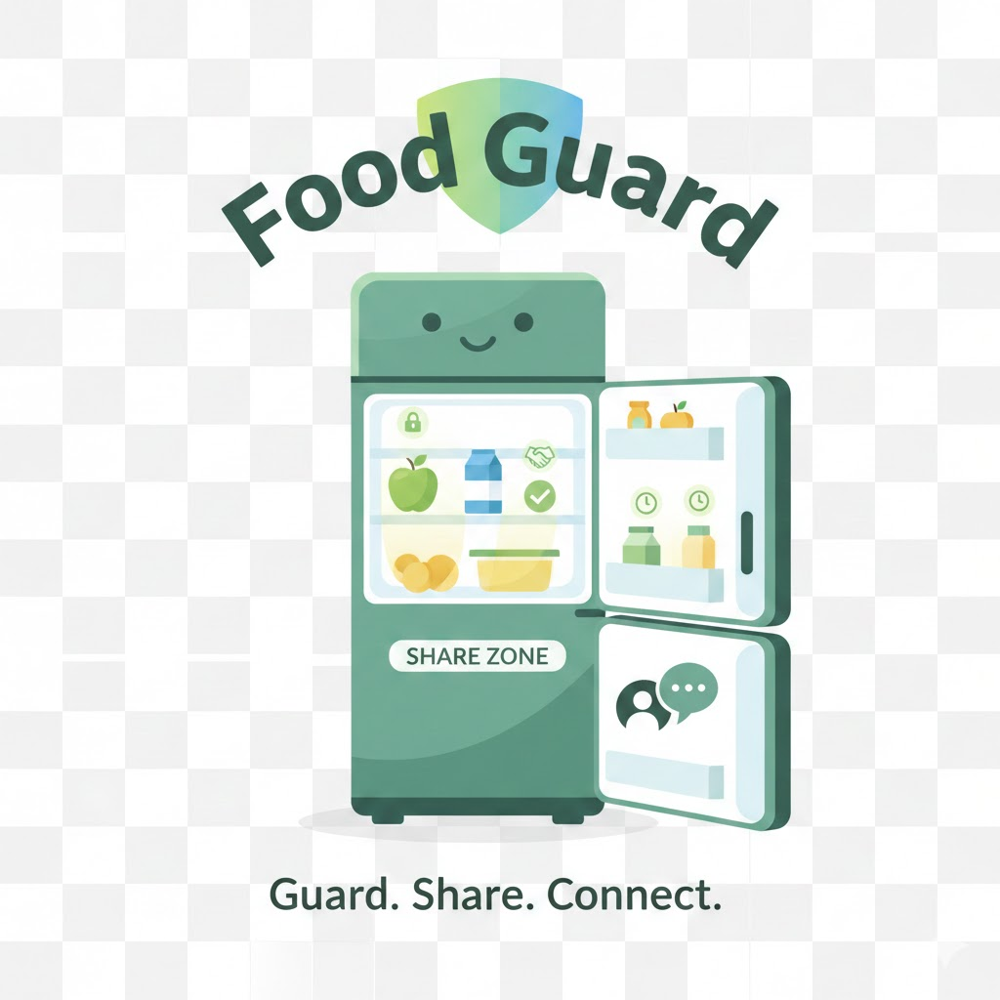
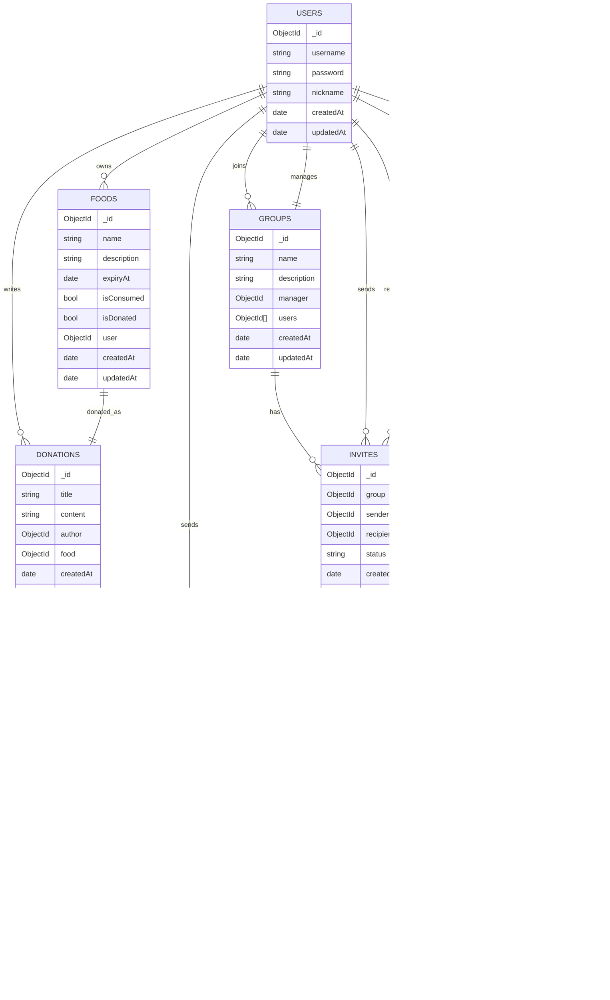
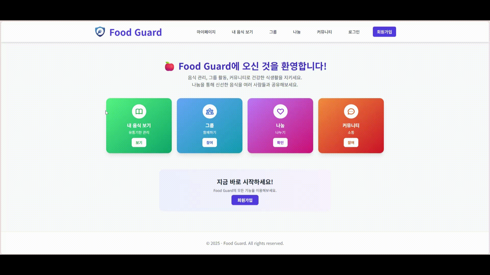
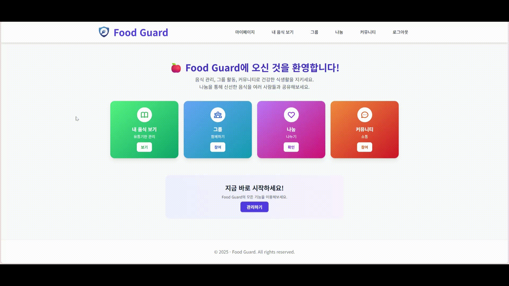
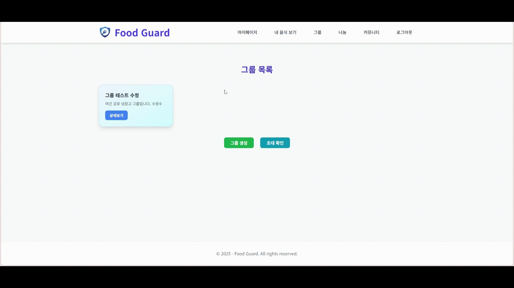

<h1 align=center> Food Guard </h1>

  

   

  
   
  
   
  
   
  

   

<h1 align="center">👋 Introduction 👋</h1>
  

    가족이 냉장고에 넣어놓은 음식을 먹었다가 혼나본 경험이 있으신가요?  
    Food Guard는 냉장고에 있는 음식이 누구의 것인지 확인할 수 있는 기능을 제공합니다. 
    이제 여러분은 누구의 음식인지 확인하여 가족과 싸우는 일을 피할 수 있습니다.  
    냉장고에 넣어두었다가 유통기한이 지나 음식을 버리는 경험이 있으신가요? 
    Food Guard는 음식을 나눔하는 기능을 제공합니다. 
    유통기한이 지나기 전에 냉장고에 넣어둔 음식을 다른 사람들에게 나누어보세요.
  

   

<h1 align="center">💾 ERD 💾</h1>
  

  

   

<h1 align="center">👀 Preview 👀</h1>
   
  

  <b><i>공사중
    

      <h3>메인페이지 ~ 로그인/로그아웃</h3>
        
    

    

      <h3>음식</h3>
        
    

    

      <h3>그룹</h3>
      

        <h4>생성/그룹원 목록/그룹 수정</h4>
          
      

      

        <h4>그룹 초대 수락/그룹 음식 생성/그룹 나가기</h4>
          
      

      

        <h4>다른 그룹원의 음식 먹기</h4>
          
      

    

    

      <h3>커뮤니티</h3>
        
    

    

      <h3>나눔</h3>
        
    

  

   

### Project Timeline

- `2025.02` ~ `2025.06`
  - **MVP** (기본적인 데이터 생성·조회·수정·삭제 기능 중심의 서비스 기반 구축)
- `2025.10` ~ `2025-02`
  - **Advanced Features & Refactoring** (Socket.io 실시간 채팅 및 코드 최적화)
